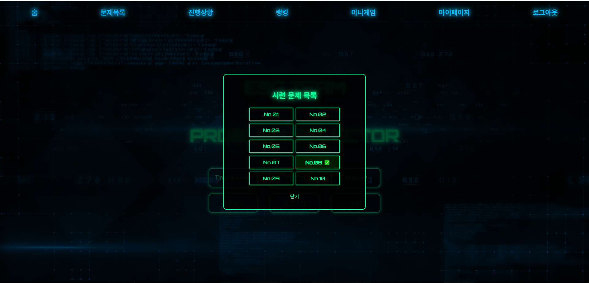

# ESG Team Problem Selector

<!-- 메인 화면 GIF or 스크린샷 -->

---

## 🔢 시련 문제 1~10 개념 요약

| 층   | 개념 요약                                                        |
| ---- | ---------------------------------------------------------------- |
| 1층  | Base64 인코딩된 문자열 디코딩 후 ‘익명(anonymous)’ 플래그 획득 :contentReference[oaicite:0]{index=0} |
| 2층  | URL 경로 직접 수정 및 ZIP 압축 해제 후 플래그 파일 획득 :contentReference[oaicite:1]{index=1} |
| 3층  | 페이지 소스 내 숨겨진 비밀 경로(secret path) 발견 후 접근 :contentReference[oaicite:2]{index=2} |
| 4층  | 인코딩된 로그 메시지를 한 줄씩 디코딩하여 플래그 획득 :contentReference[oaicite:3]{index=3} |
| 5층  | set_user.php 리다이렉션 우회 및 쿠키 수정으로 권한 상승 시뮬레이션 :contentReference[oaicite:4]{index=4} |
| 6층  | 난독화된 JavaScript(obfuscated.js) 분석 후 비밀 페이지(secret.php) 접근 :contentReference[oaicite:5]{index=5} |
| 7층  | robots.txt 및 .git 폴더 노출 복구로 전체 소스 복원 후 플래그 확인 :contentReference[oaicite:6]{index=6} |
| 8층  | JSON 토큰 변조(Token Tampering) 탐지—HMAC 검증 실패 시 차단 :contentReference[oaicite:7]{index=7} |
| 9층  | 해시 체인(Hash Chain) 1,000회 해싱값 비교로 일치 값 역산 :contentReference[oaicite:8]{index=8} |
| 10층 | XSS 페이로드로 trigger_flag_gen.php 이동 → 진짜 플래그 생성 :contentReference[oaicite:9]{index=9} |

---
## 📄 워크스루 다운로드

📄 [“병욱의 시련” 워크스루 다운로드 (DOCX)](https://raw.githubusercontent.com/byungwook99/war_game_esg/main/%EB%B3%91%EC%9A%B1%EC%9D%98%20%EC%8B%9C%EB%A0%A8%20%EB%8B%B5%EC%95%88.docx)

---

## 🔒 디렉토리 접근 제어

- **.htaccess 설정**을 통해 디렉토리 리스팅 및 비허용 파일 요청을 차단하였습니다.

